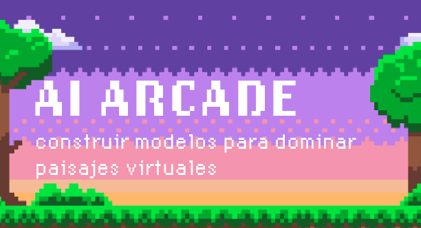

Repo for a course tought to middle and high school students participating in RWC Columbia Aug 2024.




## Table of Contents

- [About the Project](#about-the-project)
- [Features](#features)
- [Getting Started](#getting-started)
  - [Prerequisites](#prerequisites)
  - [Setup](#setup)
- [Roadmap](#roadmap)
- [Contact](#contact)
- [Libraries](#libraries)

## About the Project

AI arcade is an intruduction to AI designed to be taught to middle and high school students in both English and Spanish. The goal is to get straight into AI utilizing OpenAI's Gymnasium library, and avoid going into too much math or technical jargon. It's a walk through what it's like to use AI to solve game problems that holds your hand along the way. Ideally it should give students a grasp on AI and an idea of what it's like to train models to solve problems. the course is broken down into sections 00 - 04 and a final 10 section for the project.

## Features

- **Visuals** Utilizes Jupyter notebooks for lessons with an emphasis on visuals.
- **Easy Setup** Using Codespaces, the repo can be forked and easily opened in a dev container that is mostly pre configured.
- **Games** Using port forwarding, a remote desktop can be accessed via the browser so the students can test out the gymnasium games by playing them.
  
## Getting Started

### Prerequisites

Github student account or Github pro to access more compute. Alternativly docker and the VS code dev container extension.

### Setup

- Fork the repo and open in Codespaces
- Create a virtual invironment and download all the required packages
  
  ```python
  python -m venv venv
  source venv/bin/activate
  pip install -r requirements.txt
  ```
- Access virtual desktop to play games: open the built in vs code terminal (ctrl + ~) and navigate to the ports tab. Select the globe icon on the port 6080 to open in browser. From the opened browser page you can now connect and view your VM's desktop. 

## Roadmap

Though mostly complete the final two modules need some work.

- [x] Modules 00 - 03
- [ ] Module 04 Deep Q Learning
- [ ] Module 10 Final Project

## Contact

Noah Christopher - noah.dev@outlook.com

Project Link: [https://github.com/NSChristopher/RWC_AI_Arcade](https://github.com/NSChristopher/RWC_AI_Arcade)

## Libraries

- [Gymnasium](https://gymnasium.farama.org/)
- [MiniGrid](https://minigrid.farama.org/)
